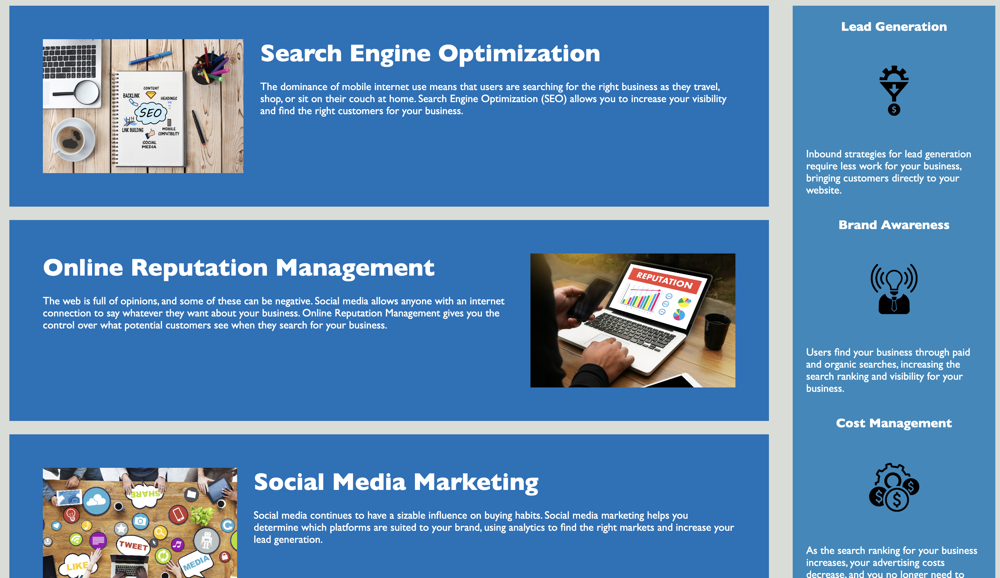

# red-challenge-1
Module 1 challenge for UC Berkeley Full Stack Development Boot Camp

## Description

Module 1 Challenge Homework. Refactor starter code for Horiseon Social Solutions, Inc webpage. Condense HTML/CSS code, improve code readibility by adding semantic elements, increase accessibility by describing images with alt text, and add webpage title.

## Installation

N/A

## Usage

Index.html file and CSS style sheets control layout and aesthetics of page. This page is live at GitHub pages launched by user malxxy.

Header:

Webpage content:

Webpage with alt text shown:

## Credits

Starter code provided by UC Berkeley Extensions. No other collaborators.

## License

N/A